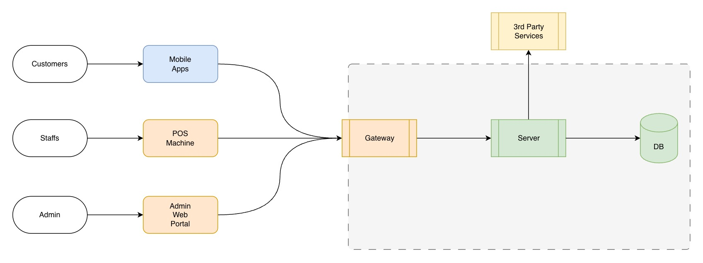

# 2. Architecture

## Old Architecture Diagram

Diagram:

## 2.1 High-Level Architecture Diagram

Diagram:

## 2.2 Architectural Style Decision

### Why Microservices?

The existing monolithic system faces critical limitations:
- Cannot scale individual features (payment spikes affect entire system)
- Single point of failure (one crash brings down everything)
- Full redeployment required for any change (high risk, slow releases)
- Database contention between real-time transactions and heavy reporting

**Comparison:**

| Consideration | Monolith | Modular Monolith | Microservices |
|---------------|----------|------------------|---------------|
| Independent Scaling | No | No | Yes |
| Independent Deployment | No | Partial | Yes |
| Failure Isolation | No | Partial | Yes |
| Operational Complexity | Low | Medium | High |
| Migration Effort | N/A | Medium | High |

**Decision: Microservices**

Given the existing problems and the need to support very high concurrent users with 99.9% uptime, microservices is the appropriate choice. The migration will be gradual—extracting ticketing, payment, and reporting into separate services first, as these have the most contention in the current system.

**Trade-off acknowledged:** Higher operational complexity, but manageable with proper observability and containerized deployment.

---

### Deployment Model: Containers (Kubernetes)

**Why containers over alternatives:**

| Option | Pros | Cons | Verdict |
|--------|------|------|---------|
| Serverless | Auto-scaling, no infra management | Cold starts, connection limits, vendor lock-in | Not suitable for seat locking (needs persistent connections) |
| PaaS | Simple deployment | Limited scaling control, expensive at scale | Insufficient for high concurrent users |
| Containers (K8s) | Fine-grained scaling, portable, industry standard | Requires K8s expertise | Best fit for our requirements |

**Decision: Kubernetes**

Containers provide the flexibility to scale each service independently while maintaining persistent connections required for real-time seat locking.

---

### Communication Patterns

| Pattern | Use Case | Technology |
|---------|----------|------------|
| Sync (External) | Client → API Gateway | REST over HTTPS |
| Sync (Internal) | Service → Service | gRPC with JWT |
| Async (Events) | Cross-service notifications | Kafka |

**When to use Sync vs Async:**

- **Sync (REST/gRPC):** When the client needs an immediate response (e.g., seat availability check, payment status)
- **Async (Kafka):** When eventual consistency is acceptable (e.g., ticket confirmation emails, reporting updates, seat availability broadcasts)

**Why Kafka for async:**
- High throughput for event streaming
- Durability and replay capability
- Supports multiple consumers (e.g., Reporting Service and Notification Service both consume payment events)

---

## 2.3 Component Breakdown

### Cinema Service
Manages cinema branches, halls, seating layouts, movies, and showtimes. Source of truth for what's playing where and when.

### Ticket Service
Handles bookings, seat locking, and ticket lifecycle (purchase, cancellation, refund, reschedule). Coordinates with Payment Service for transactions.

### Payment Service
Processes payments and refunds. Integrates with third-party payment providers. Does not store sensitive payment data (PCI compliance).

### Reporting Service
Generates analytics and operational reports. Runs on separate infrastructure to avoid impacting transactional workloads.

### Auth Service
Handles authentication (OAuth integration for customers, credential-based for staff/admins) and issues JWT tokens. Manages user roles and permissions.

