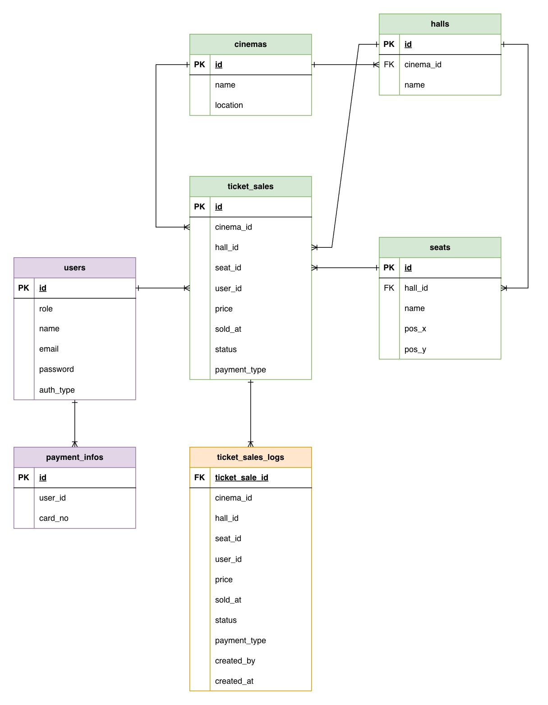

# 4. Data Model & Storage

## 4.1 Database Choice & Justification

**Choice: PostgreSQL for all services**

| Consideration | PostgreSQL | MySQL | MongoDB |
|---------------|------------|-------|---------|
| ACID Compliance | Full | Full | Partial |
| Complex Queries | Excellent | Good | Limited |
| JSON Support | Native (JSONB) | Basic | Native |
| Transactions | Strong | Strong | Limited |
| Scaling | Vertical + Read replicas | Vertical + Read replicas | Horizontal |

**Why PostgreSQL?**
- ACID transactions critical for ticket sales and payments (no double-booking)
- Strong relational model fits our domain (cinemas → halls → seats)
- Excellent query performance for reporting
- Native JSONB for flexible fields when needed
- Mature ecosystem and tooling

**Why not MongoDB?**
- Our data is highly relational (tickets reference seats, halls, cinemas)
- Need strong consistency for financial transactions
- Document model doesn't fit our use case

---

## 4.2 Data Schema

### Cinema Service (Blue)

| Table | Description |
|-------|-------------|
| `cinemas` | Cinema branches (name, location) |
| `halls` | Screening halls within a cinema |
| `seats` | Individual seats with position (pos_x, pos_y) |

### Ticket Service (Yellow)

| Table | Description |
|-------|-------------|
| `ticket_sales` | Ticket purchases linking user, cinema, hall, seat |

### Payment Service (Orange)

| Table | Description |
|-------|-------------|
| `transactions` | Payment records with provider and status |

### Auth Service (Red)

| Table | Description |
|-------|-------------|
| `users` | User accounts with role and auth type |
| `payment_infos` | Saved payment methods per user |

### Reporting Service (Green)

| Table | Description |
|-------|-------------|
| `ticket_sales_logs` | Denormalized copy of ticket data for analytics |

---

## 4.3 Data Access & Patterns

### Read vs Write Patterns

| Service | Read Pattern | Write Pattern |
|---------|--------------|---------------|
| Cinema | High reads (browse movies/seats) | Low writes (admin updates) |
| Ticket | Medium reads (check bookings) | High writes (purchases, locks) |
| Payment | Low reads | Medium writes (transactions) |
| Reporting | Heavy reads (complex queries) | Async writes (event-driven) |

### Caching Strategy

| Cache | Use Case | TTL |
|-------|----------|-----|
| Redis | Seat locks (temporary holds) | 5-10 minutes |
| Redis | Session tokens | Based on JWT expiry |
| CDN | Static content (movie posters) | 24 hours |
| In-memory | Cinema/hall metadata | 1 hour |

### Data Syncing

- **Ticket → Reporting:** Kafka events push ticket sales to Reporting Service
- **Eventual consistency:** Reporting data may lag by seconds (acceptable for analytics)
- **No cross-service joins:** Services own their data; sync via events when needed
