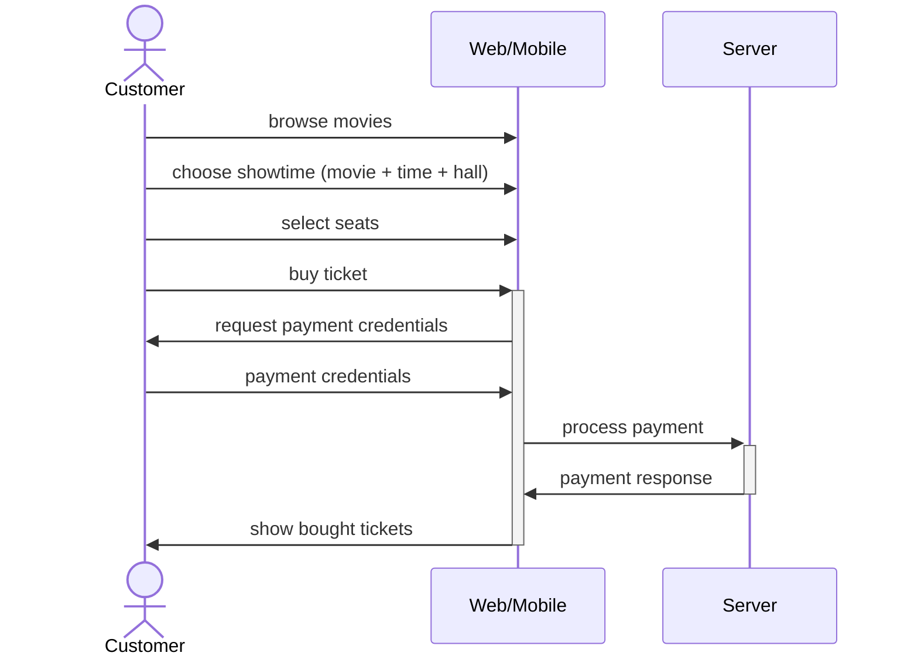
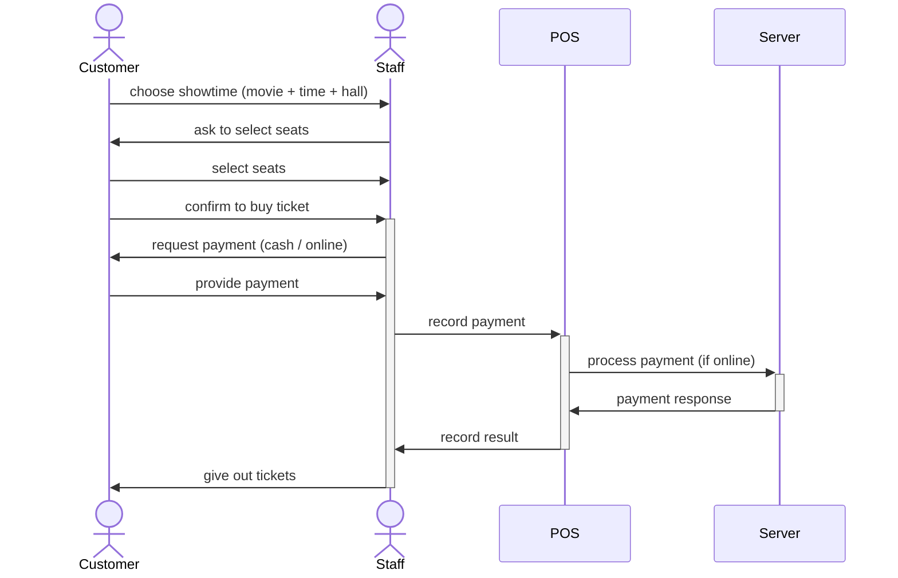
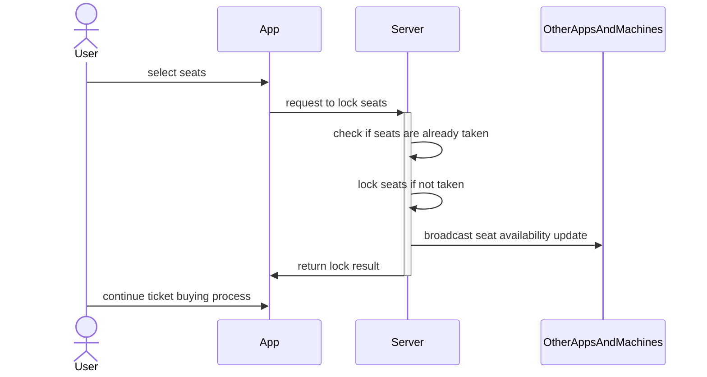
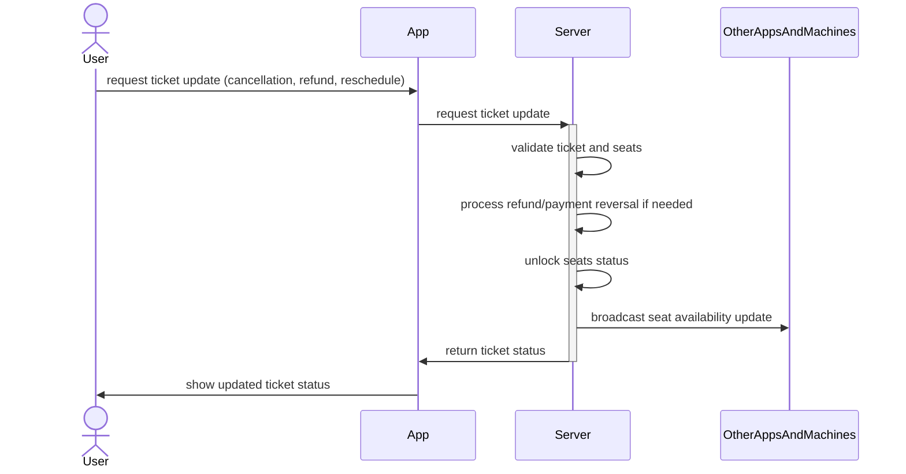

# User Flows

The following are the core business user flows:

1. Customer purchases tickets via web/mobile app
2. Customer purchases tickets via kiosk machine
3. Staff sells tickets via POS machine
4. Admin manages cinema seating
5. Admin reviews analytics reports
6. Seat locking for concurrent holds
7. Ticket management (cancellation, refund, reschedule)

## Sequence Diagrams

### 1. Customer purchases tickets via web/mobile app

### 2. Customer purchases tickets via kiosk machine

### 3. Staff sells tickets via POS machine

### 6. Seat locking for concurrent holds

### 7. Ticket management (cancellation, refund, reschedule)

