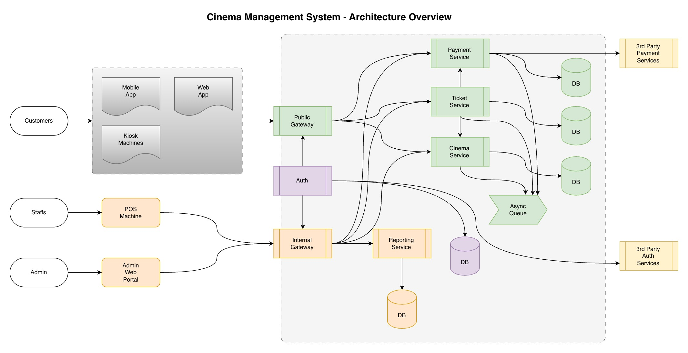
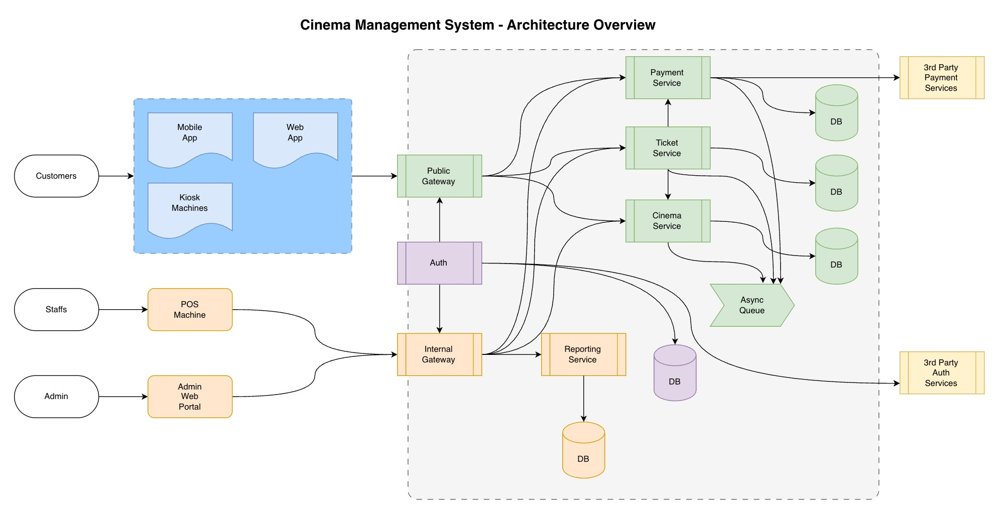

# Project Phases

## Phase I

- Goal: ship to direct system users
- Channels:
  - POS Machines
  - Admin Web Portal.
- New features / improvements:
  - improve seat locking
  - payment/reversal handling
  - reporting tuned for ops
  - monitoring/alerts for gateways and services.

Diagram:

---

## Phase II

- Goal: open customer-facing online channels.
- Channels:
  - Mobile Apps (iOS/Android)
  - Web Application.
  - Kiosk Machines
- New features / improvements:
  - scale Public Gateway
  - introduce promo/discount service
  - refine ticket delivery (QR/email/SMS/etc)
  - improve concurrency controls for higher traffic
- Planning:
  - launch in order of kiosk, web, then mobile (after payment and seat-lock implementations are healthy)
  - prioritize features based on checkout completion, drop-off, and payment failure rates.

Diagram:

---

## Future Phases

Depending of the priority of the needs, the following services will be implemented in next phases:
- Snack Store Management Service (when concession attach-rate is a priority).
- Discount and Promotion Service (to improve conversion/retention after Phase II).
- Integrations in 3rd-party apps (when there's demand; e.g., chat/wallet apps).
- Loyalty/CRM and advanced analytics (when campaigns are needed).

